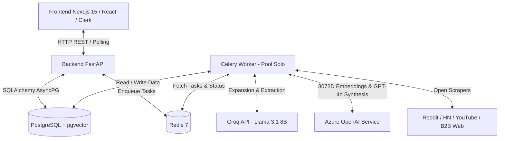

# Arquitectura Global del Sistema (System Architecture Specification)

> **Documento**: `specs/architecture.md`  
> **Estado**: Especificación Activa  
> **Plataforma**: NicheHunter B2B Market Intelligence Platform

---

## 🏗️ 1. Diagrama de la Arquitectura del Sistema



---

## 📦 2. Pila Tecnológica Estándar (Tech Stack Contracts)

### Backend Engine
- **Framework**: FastAPI (Python 3.10+) con tipado estricto Pydantic v2.
- **Async ORM**: SQLAlchemy 2.0 (AsyncIO) con `asyncpg` + extensión `pgvector`.
- **Cola de Tareas**: Celery 5.6+ utilizando Redis como Broker y Result Backend.
- **Ejecución en Windows**: Modo `--pool=solo` con reconexión automática de sockets y limpieza de pool `engine.dispose()`.

### Modelos e Inteligencia Artificial
- **Filtro Rápido & Expansión**: Groq API (`llama-3.1-8b-instant`), max 1,200 caracteres/post, pausas de 2.0s.
- **Embeddings Vectoriales**: Azure OpenAI (`text-embedding-3-large`), vector de 3,072 dimensiones.
- **Síntesis Ejecutiva de Reportes**: Azure OpenAI (`gpt-4o`).

### Motores de Datos Abiertos (100% Gratuitos)
- **Reddit**: JSON endpoints públicos (`/r/{sub}/new.json`) con rotación de User-Agents y `after` token.
- **Hacker News**: Algolia Search API (`hn.algolia.com/api/v1/search`) con paginación de hasta 3 niveles.
- **YouTube**: Transcripciones habladas con `youtube-transcript-api` + Comentarios con YouTube Data API v3 / Fallback Web.
- **B2B Web Reviews**: `duckduckgo_search` (`DDGS`) para G2, Capterra, Trustpilot, ProductHunt y LinkedIn Posts.

### Frontend App
- **Framework**: Next.js 15 (App Router, React 19, TypeScript).
- **Autenticación**: Clerk (`@clerk/nextjs`).
- **Estado y Polling**: TanStack Query (React Query v5) haciendo polling cada 2,000ms en tareas activas.
- **UI / Design System**: CSS Vanilla modular con paleta oscura premium, micro-animaciones y consola terminal en tiempo real.

---

## 🗄️ 3. Esquema de Datos Principal (Database Schema Contract)

```mermaid
erdiagram
    USERS ||--o{ SCAN_JOBS : owns
    SCAN_JOBS ||--o{ RAW_POSTS : collects
    SCAN_JOBS ||--o{ PAIN_POINT_CLUSTERS : groups
    RAW_POSTS ||--o| PAIN_POINTS : extracts
    PAIN_POINT_CLUSTERS ||--o{ PAIN_POINTS : contains
    PAIN_POINT_CLUSTERS ||--o| VALIDATION_REPORTS : generates

    USERS {
        uuid id PK
        string clerk_id
        string email
        int credits_remaining
    }
    SCAN_JOBS {
        uuid id PK
        uuid user_id FK
        string niche_query
        string target_industry
        string business_process
        string phase
    }
    RAW_POSTS {
        uuid id PK
        uuid scan_job_id FK
        string source_platform
        string title
        text body
        string url
    }
    PAIN_POINTS {
        uuid id PK
        uuid raw_post_id FK
        uuid cluster_id FK
        text description
        vector_3072 embedding
        float severity
    }
    PAIN_POINT_CLUSTERS {
        uuid id PK
        uuid scan_job_id FK
        string label
        float avg_severity_score
        int size
    }
    VALIDATION_REPORTS {
        uuid id PK
        uuid cluster_id FK
        string report_title
        string market_size_tam
        string market_growth_cagr
        string validation_verdict
    }
```
