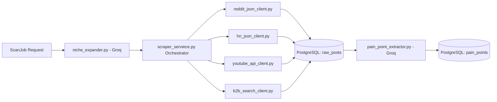

# Technical Plan: Feature 01 - Motor de Datos (Data Engine)

> **Feature**: `01-data-engine`  
> **Estado**: Plan Técnico Aprobado  
> **Ubicación**: `backend/src/services/scraper/`, `backend/src/services/ai/`

---

## 🛠️ 1. Arquitectura de Componentes del Motor



---

## 📋 2. Contratos de Datos (Data Contracts & Schemas)

### Schema de Inserción RawPost (`PostDict`)
```python
{
    "source_id": str,          # Unico global (ej. "reddit_t3_abc123" o "yt_transcript_xyz")
    "source_platform": str,    # "reddit" | "hackernews" | "youtube" | "youtube_transcript" | "g2" | "capterra" | "trustpilot" | "producthunt" | "linkedin"
    "source_community": str,   # Subreddit, query o sitio objetivo
    "title": str,              # Max 500 chars
    "body": str,               # Texto completo o transcripción recortada
    "engagement_score": int,   # Upvotes / Likes
    "reply_count": int,        # Número de comentarios
    "url": str                 # URL de la fuente original
}
```

### Schema de Salida del Extractor de Dolor LLM (`PainPointExtraction`)
```json
{
    "is_valid_pain_point": true,
    "content": "Manual reconciliation of multi-currency invoice fees causes 4-hour daily delays",
    "category": "finance",
    "severity_score": 8.5,
    "confidence_score": 0.9,
    "justification": "Direct financial impact and high daily hours lost"
}
```

---

## 🛑 3. Manejo de Excepciones y Rate Limits (SLAs)

1. **Groq API HTTP 429**:
   - `AsyncOpenAI` cliente con `max_retries = 5`.
   - Captura de `RateLimitError`: Pausa asíncrona obligatoria de 6.0s antes de reintentar.
   - Pacing entre llamadas: `await asyncio.sleep(2.0)` por cada post analizado.
   - Truncamiento de entrada: `texto_recortado = texto_del_post[:1200]`.

2. **Scraping HTTP 429 / 403 / 503**:
   - Reddit: Rotación de User-Agents desde `USER_AGENTS` list + retroceso de 10s en 429.
   - HN Algolia: Paginación de 3 niveles con pausas de 0.5s.
   - B2B Web (`duckduckgo_search` / `ddgs`): Manejo de pausas de 1.2s por sitio objetivo (`g2.com`, `capterra.com`, `trustpilot.com`, `producthunt.com`, `linkedin.com/posts`).

3. **Conexión Postgres & Redis (Windows Celery Solo Pool)**:
   - Estado en Celery mediante helper `safe_update_state(task_self, state, meta)`.
   - Limpieza del motor SQLAlchemy al finalizar corrutina: `await engine.dispose()`.
   - Conexiones con `pool_pre_ping = True` y `pool_recycle = 300`.
